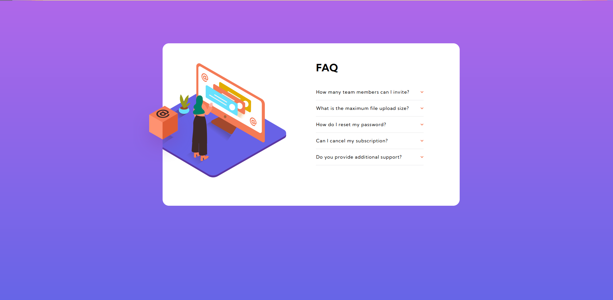

# Frontend Mentor - FAQ accordion card solution

This is a solution to the [FAQ accordion card challenge on Frontend Mentor](https://www.frontendmentor.io/challenges/faq-accordion-card-XlyjD0Oam). Frontend Mentor challenges help you improve your coding skills by building realistic projects. 

## Table of contents

- [Overview](#overview)
  - [The challenge](#the-challenge)
  - [Screenshot](#screenshot)
  - [Links](#links)
- [My process](#my-process)
  - [Built with](#built-with)
  - [What I learned](#what-i-learned)
  - [Continued development](#continued-development)
  - [Useful resources](#useful-resources)
- [Author](#author)
- [Acknowledgments](#acknowledgments)

**Note: Delete this note and update the table of contents based on what sections you keep.**

## Overview

### The challenge

Users should be able to:

- View the optimal layout for the component depending on their device's screen size
- See hover states for all interactive elements on the page
- Hide/Show the answer to a question when the question is clicked

### Screenshot

### Links

- Solution URL: [Check out the code here](https://github.com/TheCoderGuru/faq-accordion)
- Live Site URL: [Visit the live site here](https://faq-accordion-lime.vercel.app/)

## My process

### Built with

- Semantic HTML5 markup
- CSS custom properties
- Flexbox
- CSS Grid
- Mobile-first workflow

### What I learned

I learnt how to target css classes in javascript in addition to adding various classes to an eventlistener.

### Continued development

I am a bit unfamiliar with javascript syntax hence I plan to complete more projects involving javascript.

### Useful resources

- [CSS Tricks - CSS Grid](https://css-tricks.com/snippets/css/complete-guide-grid/) - This helped me with the flexbox concept and I am really glad to be recommend this article, will use it going forward.

- [MDN CSS Reference](https://developer.mozilla.org/en-US/docs/Web/CSS) - This is the guide to all the css properties with an indept explanation. Definitely recommend it.

## Author

- Frontend Mentor - [@TheCoderGuru](https://www.frontendmentor.io/profile/TheCoderGuru)
- Twitter - [@TheCoderGuru](https://www.twitter.com/TheCoderGuru)

